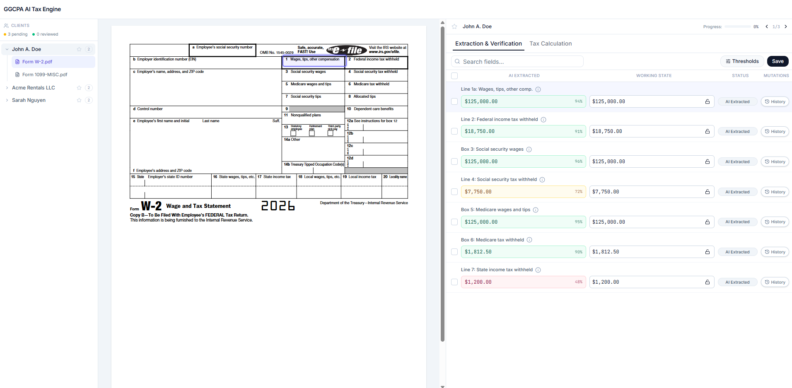
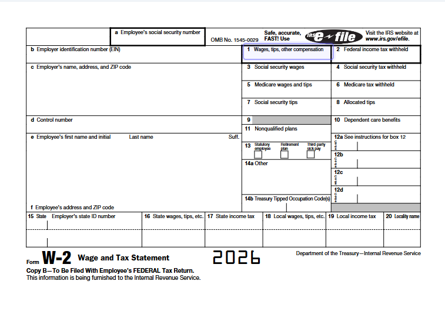
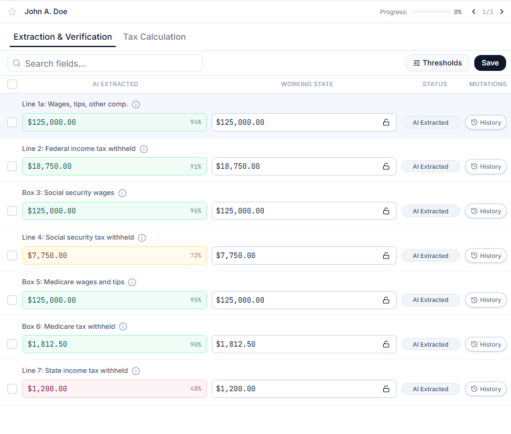
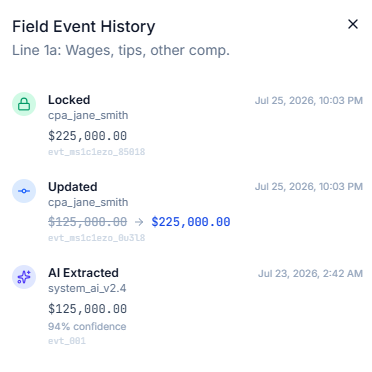
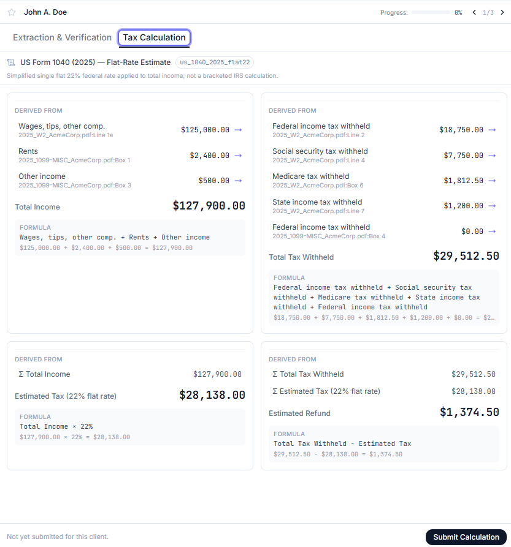

# AI Tax Platform — Interactive Return Verification Workspace

A high-density, single-page workspace for CPAs to verify AI-extracted tax
return data against its source documents, and to trace a derived tax
calculation back to the exact fields and documents behind it. Built as a
greenfield case-study prototype with zero backend dependency: all
extraction, confidence scoring, mutation history, and tax math is driven by
a client-side event-sourcing model over a hardcoded dataset.



## Quick Start

```bash
npm install
npm run dev
```

Open `http://localhost:3000`.

## What this demonstrates

- **Source document traceability** — selecting an extracted field scrolls
  the source PDF to the right page and highlights the exact bounding box it
  was read from.
- **Trustworthy AI signals** — every AI-extracted value is color-coded by
  confidence (green/amber/rose) and backed by a provenance popover (model
  version, timestamp, OCR reasoning).
- **Clickable vs. editable** — an immutable AI ground-truth column sits next
  to an editable working-state column, with Lock/Unlock controls and a full
  append-only mutation event ledger per field.
- **Traceable tax calculation** — a second tab derives Total Income, Total
  Tax Withheld, an estimated-tax figure, and a refund/balance-due total from
  the verified fields, each showing the symbolic formula and numeric
  expression that produced it, a "Derived from" lineage list that jumps back
  to the source field/document, and a named calculation scheme. Submitting
  records an auditable snapshot of exactly what was calculated, under which
  scheme, by whom, and when.

## Tech stack

React + TypeScript + Vite, Tailwind CSS, shadcn/ui (Radix primitives),
`react-pdf` for source document rendering, `lucide-react` for icons.

## What's mocked

There is no backend — everything below is hardcoded, client-side data,
standing in for what would otherwise be an extraction pipeline, a document
store, and a tax engine:

- **The tax return** (`src/mocks/taxReturnData.json`) — one seeded 1040
  return with 10 fields spanning a W-2 and a 1099-MISC. Each field carries a
  full `ai_ground_truth` record (value, confidence score, model name,
  extraction timestamp, source doc/page/bounding box, OCR reasoning text)
  plus a `current_state` and a one-event `event_history` seeded as
  `AI_EXTRACTED`. Confidence scores are deliberately spread across all three
  tiers (48%–96%) so the color-coding and threshold behavior are visible
  without editing anything.
- **Clients** (`src/mocks/clients.ts`) — three clients (John A. Doe, Acme
  Rentals LLC, Sarah Nguyen) that all share the same `SHARED_DOCUMENTS` and
  seeded field values. Only "John Doe" reads as a realistic return; the
  other two exist purely to prove out the sidebar's multi-client/document
  hierarchy and per-client review state at scale. The store's `buildFields()`
  namespaces every field's `field_id` per client (`${client_id}__${field_id}`)
  so each client's locks, edits, and mutation history are fully independent
  even though they start from identical mock values.
- **Source documents** — the W-2 is a real PDF (`public/documents/fw2.pdf`,
  rendered via `react-pdf`); the 1099-MISC has no source PDF, so it's
  rendered as an HTML facsimile (`FacsimileDocumentViewer`) with the same
  bounding-box-highlight mechanics, so the traceability story still holds
  without a real file.
- **The tax calculation itself** (`src/lib/tax-calculations.ts`) — a single
  flat-rate scheme, `us_1040_2025_flat22` ("US Form 1040 (2025) —
  Flat-Rate Estimate"), applying a flat 22% rate to total income. This is
  explicitly *not* a real IRS bracket calculation — the scheme name,
  identifier, and its `description` string all say so — it's a stand-in
  simple enough to keep the lineage/formula UI legible.
- **The current user** (`CURRENT_USER` in `src/state/tax-return-store.tsx`)
  — a single hardcoded CPA identity (`cpa_jane_smith` / "Jane Smith, CPA")
  attributed on every lock, unlock, edit, and tax calculation submission,
  standing in for an auth session.

## Design decisions

### Component placement

- **Three-column shell** (`Workspace.tsx`): client/document sidebar → source
  document viewer → verification pane. The document viewer and the
  verification grid are permanently side-by-side rather than tabbed or
  paged, because Challenge 01 (source traceability) only reads as "proof"
  if the source and the extracted value are visible in the same glance —
  putting them behind separate views would turn every check into a
  context-switch.
- **Global nav and audit history are the only things pushed into slide-over
  sheets** (`DocumentSidebar`, `EventLedgerDrawer`) — both are secondary
  context you consult occasionally, not the thing you're staring at while
  reviewing, so they're the right candidates to trade for horizontal space
  in the primary split.
- **Extraction & Verification / Tax Calculation as two tabs**, not one
  merged view. A calculated total (e.g. Total Income) draws from fields
  across *both* the W-2 and the 1099-MISC at once, which doesn't fit the
  per-document, per-row "AI Extracted vs. Working State" grid at all — that
  grid is scoped to whichever document tab is active. Splitting them keeps
  the verification grid's row model simple and gives the calculation view
  the full width it needs for formula + lineage per card.
- **The client header (star, progress, prev/next) sits above both tabs**,
  not inside either one, because it's client-scoped chrome relevant to both
  — progress reflects field-lock state, which the CPA cares about
  regardless of which tab they're looking at.
- **Field rows keep a fixed three-part shape** — read-only AI value,
  editable working value, mutation-count pill — so the immutable/editable
  distinction from Challenge 08 is a permanent layout fact, not something
  that has to be inferred from color or state.

### Color coding

Color is deliberately reserved for exactly two independent signals, kept
visually distinct so they're never confused for each other:

- **AI confidence** (`lib/confidence.ts`, ground-truth boxes only):
  🟢 emerald ≥ 85% · 🟡 amber 65–84% · 🔴 rose < 65% ("needs review").
  Thresholds are user-adjustable via the Thresholds popover rather than
  hardcoded, since what counts as "needs review" is a firm-level policy
  call, not a fixed constant.
- **Review status** (working-state badges, independent of confidence):
  slate = AI Extracted (untouched) · blue = User Modified · emerald =
  Locked. These intentionally use a different palette logic (state, not a
  score) so a CPA never has to ask "is this blue because the AI was
  unsure, or because I edited it?"
- **Mutation pill**: neutral slate at 0 mutations, amber once a field has
  ≥1 real edit — a lightweight visual flag for "this diverged from AI
  output," separate from both of the above.
- **Tax calculation cards are intentionally colorless** (neutral slate/white,
  no confidence tint). These are deterministic arithmetic over already-
  reviewed values, not AI output, so giving them a confidence-style color
  would imply an uncertainty they don't have and dilute what green/amber/red
  means everywhere else in the app.

### Lineage-tracking mindset

The app treats "lineage" as three distinct questions, each answered by its
own mechanism, all converging on the same jump-to-source interaction:

1. **Where did this extracted value come from?** — `ai_ground_truth.doc_source`
   (doc id, page, bounding box) on every field. Selecting a field scrolls
   the document viewer to that page and draws the highlight box. This is
   the "raw extraction → source document" edge.

   
   
   
2. **How did this value change over time?** — the append-only,
   `parent_id`-chained `event_history` (`AI_EXTRACTED → UPDATED → LOCKED →
   UNLOCKED`), surfaced in the mutation drawer. This is the "value → its own
   history" edge — who touched it, when, and what it was before.
   
   
3. **How was this *derived* number computed?** — every `CalculatedField` in
   `tax-calculations.ts` carries a `lineage` array (the raw fields or other
   calculated totals summed/multiplied into it), a symbolic `formula`
   ("Wages, tips, other comp. + Rents + Other income"), and a numeric
   `expression` with real values substituted in. This is the "derived
   number → its inputs" edge, and it composes: Estimated Tax's lineage
   points at Total Income, whose own lineage points at raw fields — so a
   refund figure can be traced two levels deep back to a specific box on a
   specific PDF page.

   

Rather than inventing a separate UI idiom for each of these, clicking any
lineage entry — a field row, a ledger event's field, or a "Derived from"
entry in the calculation view — always reduces to the same `selectField`
action: jump the document viewer to the right page/doc and highlight the
right box. A submitted tax calculation additionally freezes a `totals`
snapshot (label, formula, expression, formatted value) plus the scheme id
under which it ran, so even if source fields are edited afterward, the
audit trail still shows exactly what was submitted and how it was computed
at that moment.
